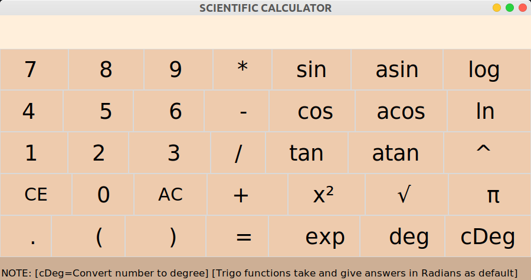

# Scientific-calculator:mortar_board:

Simple Scientific Calculator made in python, using [Tkinter](https://docs.python.org/3/library/tkinter.html)

- Buttons 0 to 9:To enter numbers
- CE: To clear a single element
- AC: To clear the entry box
- (): For brackets
- '*' : For multiplication
- '+' : For addition
- '-' : For substration
- '/' : For division
- '.' : For decimal
- '=' : For equal to(displays result)
- 'sin': For sine
- 'tan': For tan
- 'cos': For cosine
- 'asin': For sine inverse
- 'atan': For tan inverse
- 'acos': For cosine inverse
- 'log' : For logarthmic calculations(base:10)
- 'ln' : For logarthmic calculations(base:e)
- 'x2' : For squaring a number
- '^' : For x to the power y(x^y)
- 'exp': For x to the power of e(e^x)
- '√': For square roo
- 'deg' : To take input as degree

        eg. sin(deg(90)), it will first convert 90 to degrees then apply sine operation.
- 'cDeg': Convert a number to degrees
- 'π' :For pi

### Demo

**If you like it, :star:this repo :upside_down_face:**

**If you find any issues, feel free to raise issues. Enjoy!:smile:**

